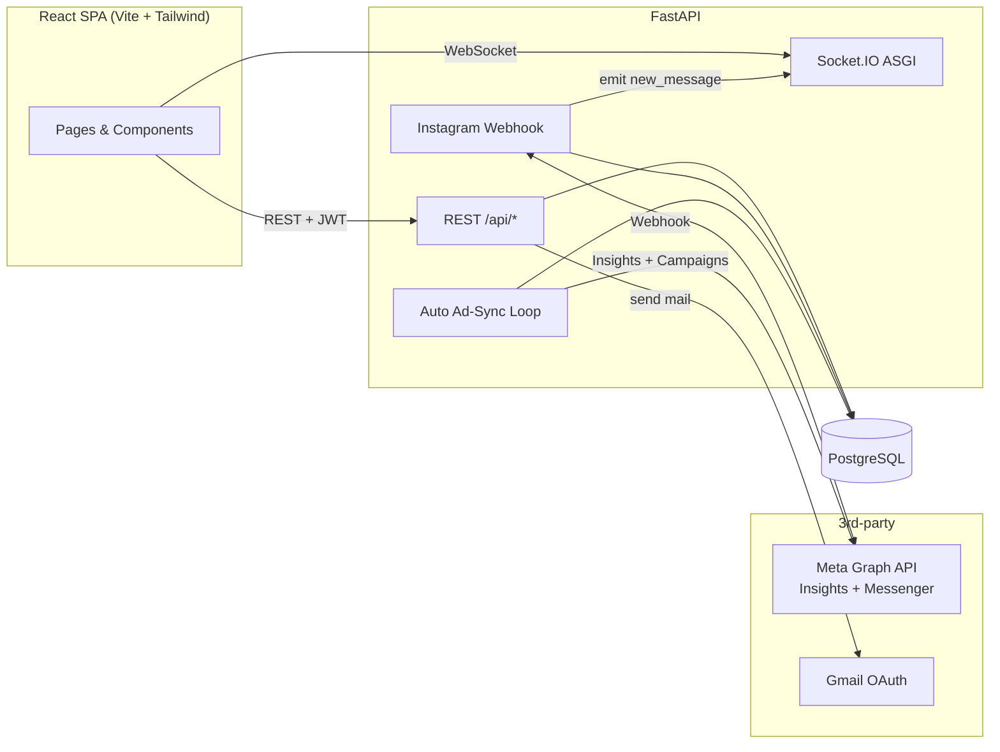

<div align="center">


# CRM & Marketing Operations Platform

**A full-stack CRM built for an education academy — messaging, ad-spend tracking, public forms and finance in one place.**

[English](./README.md) · [Türkçe](./README.tr.md)


</div>

---

## Overview

This project is a production CRM and marketing-operations platform I built end-to-end for a Turkish education academy. It replaces a mix of spreadsheets, Instagram DMs, ad-manager dashboards and manual finance tracking with a single web app.

The system ingests Instagram Direct Messages via the Meta Graph webhook, keeps a Kanban-style contact pipeline, syncs Meta ad-spend at the account/campaign/adset level, publishes dynamic seminar-registration forms, sends templated e-mails through Gmail OAuth, and tracks income/expense with document attachments — all behind JWT auth and role-based access.

**Live deployment:** Railway (backend + frontend). Contact me if you'd like a demo login.

## Screenshots

> _Add screenshots of the dashboard, messaging screen, and advertising page here._

<!-- Suggested layout:
| Dashboard | Messaging | Advertising |
|---|---|---|
|  |  |  |
-->

## Features

### Contact & Pipeline Management
- Unified contact record: platform, sector, training set, purchase potential, assigned advisor.
- Custom Kanban statuses with colors, activity log per contact, and reminders with due dates.
- **Cross-platform contact linking** — merge duplicate Instagram + WhatsApp records into one canonical profile.

### Real-time Messaging (Instagram DM)
- Meta Graph webhook receives inbound DMs and pushes them to the UI over **Socket.IO**.
- Backfill via `/api/sync-conversations` against the Graph API, with a configurable cutoff.
- Enforces Meta's 24-hour customer-care window on the reply UI (`/api/conversations/{id}/window`).
- **Quick replies** with audio attachments, stored server-side and reusable across conversations.

### Advertising Analytics (Meta Ads)
- Auto-sync loop pulls Insights + campaign objects every N hours (see `advertising.py`).
- Ad spend denormalized per **account × day × adset** with a unique constraint for idempotent upserts.
- Campaign live-status tracker (active / paused / issues) — pulled from `/{act_id}/campaigns` because Insights hides paused ones.
- Token health monitoring in `ad_sync_state` (expiry, last successful sync, error message).

### Public Seminar Forms
- Dynamic form builder — each form has a unique slug, a JSON `fields` schema and a public page.
- Auto-emails registrants via **Gmail OAuth** (refresh tokens stored encrypted) with per-company `From` identities.
- Wix CSV import + phone/e-mail based contact matching (dedup key).

### Finance
- Income / expense with per-transaction bank account, currency and document attachment (stored as `LargeBinary`).
- Payments linked to contacts for lifetime-value reporting.

### Dashboard & Reports
- KPIs, financial summary, status distribution, activity feed and upcoming reminders on the home screen.
- Campaign arrivals report (which ad produced which lead) and trend charts.

### Ops
- JWT auth with bcrypt-hashed passwords; user roles (`admin` / `user`).
- Encrypted secrets on the server (`services/crypto.py` — Fernet) for SMTP passwords, OAuth client secrets and refresh tokens.
- In-app bug/issue tracker with image attachments so testers report from the same UI.

## Tech Stack

**Backend** — FastAPI · SQLAlchemy 2 · PostgreSQL (via `pg8000`) · Socket.IO (`python-socketio`) · httpx · PyJWT · bcrypt · cryptography · uvicorn.

**Frontend** — React 19 · Vite 8 · Tailwind CSS 4 · React Router 7 · Axios · `socket.io-client`.

**Infrastructure** — Railway (backend `Procfile` + frontend Nixpacks) · Meta Graph API · Gmail OAuth.

## Architecture



**ASGI stack:** `FastAPI` → wrapped by `socketio.ASGIApp` → wrapped by `CORSMiddleware`. The deploy target is `app.main:socket_app` (not `app`).

## Getting Started

### Prerequisites
- Python 3.11+
- Node.js 20+
- PostgreSQL 14+ (a Railway or Supabase URL works)
- A Meta app with Instagram Messaging + Marketing API permissions (only needed for those features)

### Backend

```bash
cd backend
python -m venv venv
# Windows: venv\Scripts\activate    macOS/Linux: source venv/bin/activate
pip install -r requirements.txt

cp .env.example .env   # then fill in the values

uvicorn app.main:socket_app --reload
```

> **Important:** the entry point is `app.main:socket_app`, not `app.main:app`. Using `:app` silently breaks Socket.IO and CORS.

### Frontend

```bash
cd frontend
npm install
npm run dev
```

The API base URL is a constant in `src/api.js` / `src/App.jsx` pointing at the Railway production host. Change it to `http://localhost:8000/api` for local development.

## Environment Variables

Kept in `backend/.env` (never committed). See `backend/.env.example` for the full list. Key variables:

| Name | Purpose |
|---|---|
| `DATABASE_URL` | PostgreSQL URL. The app rewrites the driver to `pg8000` automatically. **Required at import time.** |
| `INSTAGRAM_TOKEN` | Meta Page access token for the Messenger Graph API. |
| `WEBHOOK_VERIFY_TOKEN` | Shared secret for the Meta webhook handshake (`GET /api/webhook`). |
| `JWT_SECRET` | Signing key for access tokens. |
| `FERNET_KEY` | Symmetric key used to encrypt SMTP passwords and OAuth secrets in the DB. |
| `ALLOWED_ORIGINS` | Comma-separated CORS origins; falls back to `*` if empty. |
| `META_APP_ID` / `META_APP_SECRET` | Marketing API access for ad-spend sync. |
| `GOOGLE_OAUTH_*` | Gmail OAuth client credentials for the "Send with Google" flow. |

## API Overview

All routes are mounted under `/api`:

| Prefix | Purpose |
|---|---|
| `/auth`, `/users` | JWT login, user CRUD, role management |
| `/webhook` | Meta Graph verification + inbound-message ingestion |
| `/messages`, `/conversations` | Message send, conversation list, 24h-window check |
| `/contacts` | Contact CRUD, filters, linking/dedup |
| `/statuses`, `/sectors`, `/training-sets`, `/creatives` | Pipeline lookup tables |
| `/quick-replies` | Reusable message templates (text + audio) |
| `/reminders` | Scheduled follow-ups |
| `/advertising` | Meta Ads sync, spend queries, campaign status, token health |
| `/payments`, `/bank-accounts` | Finance |
| `/seminar-forms`, `/public/forms` | Dynamic public forms + registrations |
| `/companies`, `/mail-settings` | Sender identities & Gmail OAuth |
| `/issues` | In-app bug tracker |
| `/dashboard` | Aggregated KPIs |

FastAPI's built-in OpenAPI docs are exposed at `/docs` when the server is running.

## Project Structure

```
crm-prebably/
├─ backend/
│  ├─ app/
│  │  ├─ api/            ← Routers (one file per domain)
│  │  ├─ models/         ← SQLAlchemy models (single-file domain)
│  │  ├─ services/       ← Crypto, mail
│  │  ├─ auth.py         ← JWT + password hashing
│  │  ├─ database.py     ← Engine, session factory, pg8000 driver rewrite
│  │  └─ main.py         ← ASGI stack, lifespan, auto-sync loop, migrations
│  ├─ requirements.txt
│  ├─ Procfile
│  └─ .env.example
├─ frontend/
│  ├─ src/
│  │  ├─ pages/          ← Route-level screens
│  │  ├─ components/     ← Shared UI (Sidebar, modals, panels)
│  │  ├─ api.js          ← Axios instance + auth header
│  │  ├─ AuthContext.jsx ← JWT session state
│  │  └─ main.jsx
│  ├─ vite.config.js
│  └─ package.json
├─ CLAUDE.md              ← AI-assistant notes for this repo
├─ privacy-policy.html
└─ README.md
```

## Deployment

Both apps deploy to **Railway**.

- **Backend** — `Procfile` runs `uvicorn app.main:socket_app --host 0.0.0.0 --port $PORT`. Environment variables are provided by Railway.
- **Frontend** — `nixpacks.toml` handles `npm install`; build/start come from `package.json`.

Schema evolution is **idempotent** and runs on startup: `Base.metadata.create_all` creates new tables, and hand-written `ALTER TABLE ... IF NOT EXISTS` statements in `lifespan()` add columns/indexes to existing tables. There is no Alembic — new columns on existing tables must be added there.

## Design Notes

A few decisions worth calling out for anyone reading the code:

- **No Alembic.** Schema changes go through `create_all` (new tables) + idempotent `ALTER TABLE IF NOT EXISTS` blocks in `main.py`'s `lifespan`. Trade-off: simpler for a single-tenant app, at the cost of migration history.
- **Encrypted secrets at rest.** SMTP passwords, OAuth client secrets and refresh tokens are Fernet-encrypted before being stored in `mail_settings`, so a DB dump doesn't leak the keys.
- **Ad-spend vs. ad-status.** Meta's Insights API doesn't return paused campaigns, so campaign live-status is fetched separately from `/{act_id}/campaigns` and stored in `ad_campaigns`.
- **Contact deduplication.** `contact_links` maps two `Contact` rows to one canonical profile (`primary_contact_id`). The convention `contact_a_id < contact_b_id` prevents mirror rows.
- **Turkish enum values.** `Contact.purchase_potential` is a Postgres enum with Turkish values (`'düşük' | 'orta' | 'yüksek'`). Changing them requires a manual `ALTER TYPE`.

## About This Project

I built this as a real production tool, not a portfolio demo — the academy actively uses it to manage leads, track ad spend, publish seminar signups and reconcile payments. It shows how I approach a full-stack build: pick boring, load-bearing tech (FastAPI + Postgres + React), keep the model layer honest, integrate external APIs safely (webhooks + encrypted OAuth), and ship on Railway with minimal moving parts.

If you're a hiring manager and want a walkthrough of a specific part (webhook handling, ad sync, OAuth flow, the frontend data model), open an issue or reach out.

## License

[MIT](./LICENSE) © Enes Gunel
