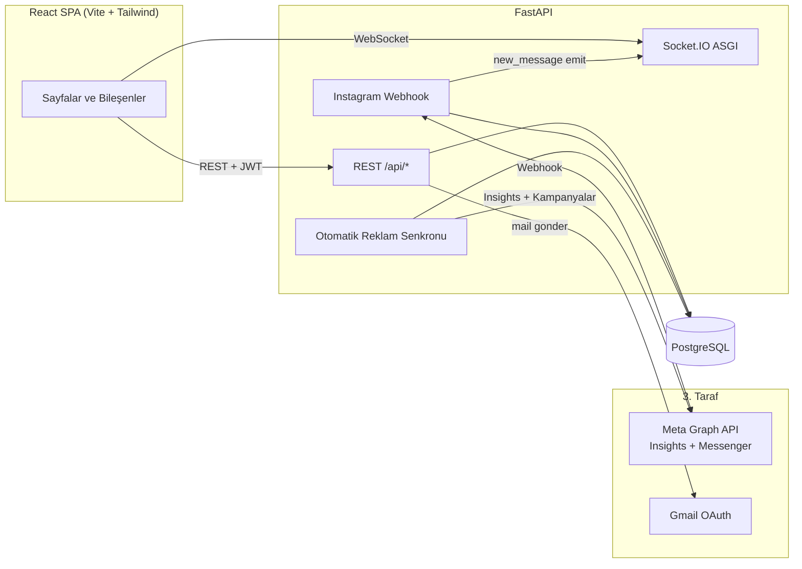

<div align="center">


# CRM ve Pazarlama Operasyon Platformu

**Bir eğitim akademisi için baştan sona geliştirilmiş, mesajlaşma + reklam takibi + halka açık formlar + finansı tek çatı altında toplayan tam yığın CRM.**

[English](./README.md) · [Türkçe](./README.tr.md)


</div>

---

## Genel Bakış

Bir Türkiye merkezli eğitim akademisi için uçtan uca geliştirdiğim üretimde çalışan CRM ve pazarlama-operasyon platformu. Excel tabloları, Instagram DM'leri, reklam yönetim panelleri ve manuel finans takibinin dağınık akışını tek bir web uygulaması altında birleştiriyor.

Sistem Meta Graph webhook'u üzerinden Instagram Direct Message'ları alıyor, Kanban tarzı bir kişi hattı (pipeline) tutuyor, Meta reklam harcamalarını hesap/kampanya/adset kırılımında senkronluyor, dinamik seminer kayıt formları yayınlıyor, Gmail OAuth üzerinden şablonlu e-postalar gönderiyor, gelir/gider takibini belge ekleriyle yapıyor — hepsi JWT auth ve rol tabanlı erişim arkasında.

**Canlı ortam:** Railway (backend + frontend). Demo girişi için iletişime geçebilirsiniz.

## Ekran Görüntüleri

> _Buraya dashboard, mesajlaşma ekranı ve reklam sayfasının ekran görüntüleri eklenecek._

<!-- Önerilen düzen:
| Dashboard | Mesajlaşma | Reklamlar |
|---|---|---|
|  |  |  |
-->

## Özellikler

### Kişi ve Pipeline Yönetimi
- Birleşik kişi kaydı: platform, sektör, eğitim seti, satın alma potansiyeli, atanan danışman.
- Renklerle özelleştirilen Kanban durumları, kişi bazında aktivite kaydı ve tarihli hatırlatıcılar.
- **Platformlar arası kişi eşleme** — bir Instagram + bir WhatsApp kaydını tek kanonik profil altında birleştirme.

### Gerçek-zamanlı Mesajlaşma (Instagram DM)
- Meta Graph webhook'u gelen mesajları alıp UI'ya **Socket.IO** ile anlık iletir.
- `/api/sync-conversations` Graph API üzerinden geçmiş mesajları yapılandırılabilir bir tarih kesimine kadar geri doldurur.
- Yanıt arayüzü Meta'nın 24 saatlik müşteri hizmetleri penceresini `/api/conversations/{id}/window` üzerinden zorunlu kılar.
- **Hızlı yanıtlar** ses eki desteğiyle; sunucuda saklanır, tüm konuşmalarda tekrar kullanılır.

### Reklam Analitiği (Meta Ads)
- Otomatik senkron döngüsü N saatte bir Insights + kampanya nesnelerini çeker (bkz. `advertising.py`).
- Reklam harcaması **hesap × gün × adset** kırılımında saklanır; unique constraint idempotent upsert sağlar.
- Kampanya canlı durumu (aktif / duraklatıldı / sorunlu) — Insights duraklatılmış kampanyaları döndürmediği için ayrıca `/{act_id}/campaigns`'den çekilir.
- Token sağlığı `ad_sync_state` içinde izlenir (süresi, son başarılı senkron, hata mesajı).

### Halka Açık Seminer Formları
- Dinamik form yapıcı — her formun benzersiz slug'ı, JSON `fields` şeması ve public sayfası var.
- Kayıt yapanlara **Gmail OAuth** ile otomatik e-posta (refresh token'lar şifreli saklanır), şirket bazında `From` kimliği.
- Wix CSV içe aktarma + telefon/e-posta üzerinden kişiye eşleme (dedup key).

### Finans
- Gelir / gider; işlem başına banka hesabı, para birimi ve belge eki (`LargeBinary`).
- Ödemeler kişilere bağlanır — müşteri yaşam boyu değer raporu için.

### Dashboard ve Raporlar
- Anasayfada KPI'lar, finans özeti, durum dağılımı, aktivite akışı ve yaklaşan hatırlatmalar.
- Kampanya kaynağı raporu (hangi reklam hangi lead'i getirdi) ve trend grafikleri.

### Operasyon
- JWT auth, bcrypt ile şifrelenmiş parolalar; kullanıcı rolleri (`admin` / `user`).
- Sunucu tarafı şifrelenmiş sırlar (`services/crypto.py` — Fernet): SMTP parolaları, OAuth client secret'ları, refresh token'lar.
- Uygulama içi hata/görev takibi — test edenler ekran görüntüsü ekleyerek aynı UI'dan rapor eder.

## Teknoloji Yığını

**Backend** — FastAPI · SQLAlchemy 2 · PostgreSQL (`pg8000` sürücüsü) · Socket.IO (`python-socketio`) · httpx · PyJWT · bcrypt · cryptography · uvicorn.

**Frontend** — React 19 · Vite 8 · Tailwind CSS 4 · React Router 7 · Axios · `socket.io-client`.

**Altyapı** — Railway (backend `Procfile` + frontend Nixpacks) · Meta Graph API · Gmail OAuth.

## Mimari



**ASGI yığını:** `FastAPI` → `socketio.ASGIApp` ile sarılır → `CORSMiddleware` ile sarılır. Deploy hedefi `app.main:socket_app`'tir (`app` değil).

## Başlangıç

### Ön Koşullar
- Python 3.11+
- Node.js 20+
- PostgreSQL 14+ (Railway veya Supabase URL'i işe yarar)
- Instagram Messaging + Marketing API izinli bir Meta app (sadece bu özellikler için gerekli)

### Backend

```bash
cd backend
python -m venv venv
# Windows: venv\Scripts\activate    macOS/Linux: source venv/bin/activate
pip install -r requirements.txt

cp .env.example .env   # sonra değerleri doldurun

uvicorn app.main:socket_app --reload
```

> **Önemli:** Giriş noktası `app.main:socket_app`, `app.main:app` değil. `:app` kullanmak Socket.IO ve CORS'u sessizce bozar.

### Frontend

```bash
cd frontend
npm install
npm run dev
```

API base URL'i `src/api.js` / `src/App.jsx` içinde sabit bir constant olarak Railway prod host'una yönlendirilmiş durumda. Lokal geliştirme için `http://localhost:8000/api` olarak değiştirin.

## Ortam Değişkenleri

`backend/.env` içinde tutulur (asla commit edilmez). Tam liste için `backend/.env.example`. Kritik değişkenler:

| İsim | Amaç |
|---|---|
| `DATABASE_URL` | PostgreSQL URL'i. Uygulama sürücüyü otomatik `pg8000`'e çevirir. **Import anında zorunlu.** |
| `INSTAGRAM_TOKEN` | Messenger Graph API için Meta Page access token. |
| `WEBHOOK_VERIFY_TOKEN` | Meta webhook doğrulama handshake'i için paylaşılan sır. |
| `JWT_SECRET` | Access token imzalama anahtarı. |
| `FERNET_KEY` | SMTP parolalarını ve OAuth sırlarını DB'de şifrelemek için simetrik anahtar. |
| `ALLOWED_ORIGINS` | Virgülle ayrılmış CORS origin'leri; boşsa `*`'a düşer. |
| `META_APP_ID` / `META_APP_SECRET` | Reklam harcaması senkronu için Marketing API erişimi. |
| `GOOGLE_OAUTH_*` | "Google ile Gönder" akışı için Gmail OAuth client bilgileri. |

## API Özeti

Tüm yollar `/api` altında:

| Prefix | Amaç |
|---|---|
| `/auth`, `/users` | JWT login, kullanıcı CRUD, rol yönetimi |
| `/webhook` | Meta Graph doğrulaması + gelen mesaj alımı |
| `/messages`, `/conversations` | Mesaj gönderme, konuşma listesi, 24s pencere kontrolü |
| `/contacts` | Kişi CRUD, filtreler, eşleme/dedup |
| `/statuses`, `/sectors`, `/training-sets`, `/creatives` | Pipeline lookup tabloları |
| `/quick-replies` | Yeniden kullanılabilir mesaj şablonları (metin + ses) |
| `/reminders` | Planlı hatırlatmalar |
| `/advertising` | Meta Ads senkronu, harcama sorguları, kampanya durumu, token sağlığı |
| `/payments`, `/bank-accounts` | Finans |
| `/seminar-forms`, `/public/forms` | Dinamik public formlar + kayıtlar |
| `/companies`, `/mail-settings` | Gönderen kimlikleri ve Gmail OAuth |
| `/issues` | Uygulama içi hata takip |
| `/dashboard` | Toplam KPI'lar |

FastAPI'nin dahili OpenAPI dokümanı sunucu çalışırken `/docs` altında.

## Proje Yapısı

```
crm-prebably/
├─ backend/
│  ├─ app/
│  │  ├─ api/            ← Router'lar (her alan için ayrı dosya)
│  │  ├─ models/         ← SQLAlchemy modelleri (tek dosyada domain)
│  │  ├─ services/       ← Şifreleme, mail
│  │  ├─ auth.py         ← JWT + parola hash'leme
│  │  ├─ database.py     ← Engine, session factory, pg8000 sürücü rewrite
│  │  └─ main.py         ← ASGI yığını, lifespan, otomatik senkron, migration
│  ├─ requirements.txt
│  ├─ Procfile
│  └─ .env.example
├─ frontend/
│  ├─ src/
│  │  ├─ pages/          ← Route seviyesi ekranlar
│  │  ├─ components/     ← Ortak UI (Sidebar, modal'lar, panel'ler)
│  │  ├─ api.js          ← Axios instance + auth header
│  │  ├─ AuthContext.jsx ← JWT oturum state'i
│  │  └─ main.jsx
│  ├─ vite.config.js
│  └─ package.json
├─ CLAUDE.md              ← Bu repo için AI asistan notları
├─ privacy-policy.html
└─ README.md
```

## Dağıtım

Her iki uygulama da **Railway**'e deploy edilir.

- **Backend** — `Procfile` `uvicorn app.main:socket_app --host 0.0.0.0 --port $PORT` komutunu çalıştırır. Ortam değişkenleri Railway tarafından sağlanır.
- **Frontend** — `nixpacks.toml` `npm install` yapar; build/start `package.json`'dan gelir.

Şema evrimi başlangıçta çalışır ve **idempotent**tir: `Base.metadata.create_all` yeni tabloları oluşturur, `lifespan()` içindeki elle yazılmış `ALTER TABLE ... IF NOT EXISTS` ifadeleri mevcut tablolara kolon/index ekler. Alembic yok — mevcut tablolara yeni kolon oradan eklenir.

## Tasarım Notları

Kodu okuyacaklar için altı çizilmesi gereken birkaç karar:

- **Alembic yok.** Şema değişiklikleri `create_all` (yeni tablolar) + `main.py`'nin `lifespan`'ındaki idempotent `ALTER TABLE IF NOT EXISTS` blokları üzerinden gider. Trade-off: tek kiracılı bir uygulama için sadelik; karşılığında migration geçmişi yok.
- **Sırlar şifreli saklanır.** SMTP parolaları, OAuth client secret'ları ve refresh token'lar `mail_settings`'e yazılmadan önce Fernet ile şifrelenir; bir DB dump'ı anahtarları sızdırmaz.
- **Reklam harcaması vs. reklam durumu.** Meta'nın Insights API'si duraklatılmış kampanyaları döndürmediği için kampanya canlı durumu ayrıca `/{act_id}/campaigns`'den çekilip `ad_campaigns`'da tutulur.
- **Kişi tekilleştirme.** `contact_links` iki `Contact` satırını tek bir kanonik profile (`primary_contact_id`) eşler. `contact_a_id < contact_b_id` konvansiyonu ayna satırları engeller.
- **Türkçe enum değerleri.** `Contact.purchase_potential` Türkçe değerli bir Postgres enum (`'düşük' | 'orta' | 'yüksek'`). Değiştirmek manuel `ALTER TYPE` gerektirir.

## Proje Hakkında

Bu projeyi bir portföy demosu olarak değil, gerçek bir üretim aracı olarak yazdım — akademi bunu aktif kullanıyor: lead takibi, reklam harcaması izleme, seminer kayıtları, ödeme uzlaştırma. Full-stack bir işe nasıl yaklaştığımı gösteriyor: sıkıcı ama sağlam teknolojiler (FastAPI + Postgres + React), dürüst bir model katmanı, dış API'larla güvenli entegrasyon (webhook + şifreli OAuth) ve Railway üzerinde az hareketli parçayla teslim.

Bir alanı (webhook işleme, reklam senkronu, OAuth akışı, frontend veri modeli) daha yakından anlatmamı isterseniz issue açabilir ya da doğrudan bana ulaşabilirsiniz.

## Lisans

[MIT](./LICENSE) © Enes Gunel
